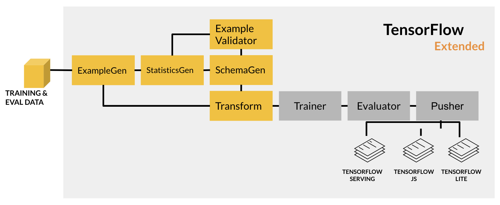

# Feature Engineering Pipeline in TFX

In production-grade projects, you want to streamline tasks so you can more easily improve your model or find issues that may arise. [Tensorflow Extended (TFX)](https://www.tensorflow.org/tfx) provides components that work together to execute the most common steps in a machine learning project.

In this project, I'll take you through the steps to build your own feature engineering pipeline. Specifically, I will:

* ingest data from a base directory with `ExampleGen`
* compute the statistics of the training data with `StatisticsGen`
* infer a schema with `SchemaGen`
* detect anomalies in the evaluation data with `ExampleValidator`
* preprocess the data into features suitable for model training with `Transform`

The components I will use are the orange boxes highlighted in the figure below:

